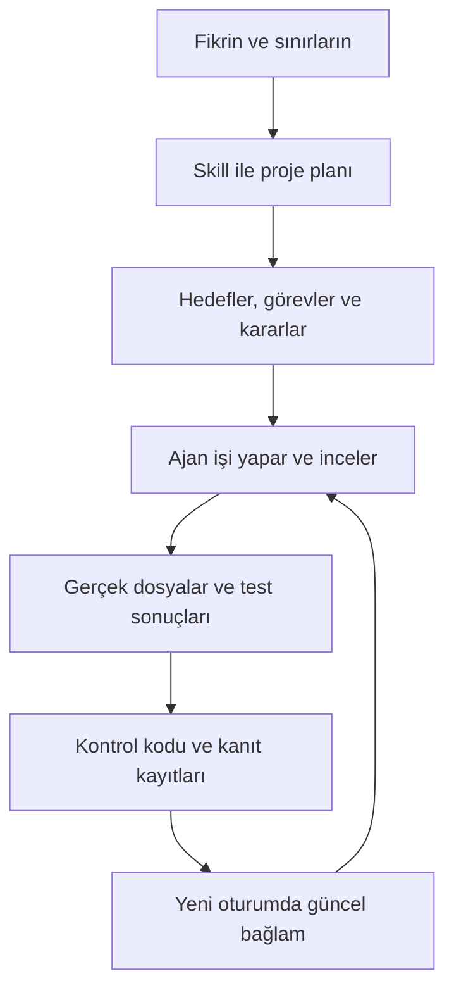

<div align="center">

# Proje Başlat

### Fikrini anlat. İlk işi netleştir. Yeni oturumda kaldığın yerden devam et.

AI ile birkaç oturuma yayılan projeler için hedef, görev, karar ve kanıt düzeni.

**v0.2 pilot · Türkçe · Python standart kütüphanesi · Yerel dosyalar**

[Hemen dene](#hemen-dene) · [Nasıl çalışır?](#nasıl-çalışır) · [Sık sorulanlar](docs/SIK-SORULAN-SORULAR.md) · [Teknik yapı](TEKNIK-TASARIM.md)

</div>

---

## “Bunu neden yapıyorduk, neye karar vermiştik?”

Yeni bir AI oturumunda hedefi tekrar anlatmak, önerileri alınmış kararlarla
karıştırmak veya değişmiş bir dosyayı hâlâ tamamlanmış saymak kolaydır.
**Proje Başlat**, bu bilgileri projenin yanında duran okunabilir kayıtlarda tutar.

Örneğin ajana şunu söyle:

> Yeni bir Türkçe AI bülteni hazırlamak istiyorum. İlk sayı üç haberden oluşsun;
> her haber kaynaklı olsun. Şimdilik yalnız proje düzenini kur.

Skill hedefi, sınırları, ilk görevleri ve başarı ölçütlerini netleştirir.
Önerileri kabul edilmiş karar saymaz. Sonraki oturumda hangi işin başlayabileceği
ve hangi kanıtın değiştiği yeniden kontrol edilir.

## Bugün ne yapıyor?

| İhtiyacın | Karşılığı |
|---|---|
| Fikri somutlaştırmak | Hedef, kapsam, açık sorular ve gözlenebilir başarı ölçütleri |
| İş sırasını görmek | Görevler ve açık önkoşullar |
| Kararları korumak | Önerilmiş, kabul edilmiş ve yerini yeni karara bırakmış seçimler |
| Değişmiş teslimi fark etmek | Dosyanın kayıtlı SHA-256 özetiyle güncel sürümünü karşılaştırma |
| Projeye yeni iş eklemek | Nesne, ilişki ve görev ekleme; görev tanımını revize etme |
| Yeni oturumda devam etmek | Güncel görevler, engeller ve yeniden inceleme gerektiren işler |

**İşi ajan yapar. Skill yöntemi tarif eder. Python belirli kayıt kurallarını denetler.**
Arka planda kendi başına çalışan bir ajan servisi yoktur.

## Hemen dene

Git, Python 3.10+ ve dosya okuyup komut çalıştırabilen bir AI ajanı gerekir.
Python 3.10+ sözdizimi hedeflenir; fiilî test ortamı ve sonucu
[doğrulama notunda](docs/DOGRULAMA.md) belirtilmiştir. Ek Python paketi gerekmez.

```sh
git clone https://github.com/fornhere/proje-baslat-skill.git
cd proje-baslat-skill
```

Bu klasörü AI ajanının çalışma alanında aç ve şu mesajı gönder:

> `skills/proje-baslat/SKILL.md` dosyasını oku ve uygula. Yeni bir Türkçe AI
> bülteni için `../benim-bultenim` klasöründe proje düzeni kur. İlk çıktı üç
> kaynaklı haber olsun. Şimdilik yalnız kurulumu yap.

Kendi fikrinle bülten örneğini değiştirebilirsin. Hedefi, istediğin ilk çıktıyı
ve önemli sınırları söyle; JSON dosyasını sen doldurmazsın.

**Doğrudan SKILL.md yolu, denenmiş kullanım yoludur.** Depodaki
`.agents/skills/proje-baslat` bağlantısı keşif için bulunur; otomatik keşif
istemciye bağlıdır ve her istemcide doğrulanmış değildir. Skill ajanın listesinde
zaten görünüyorsa `$proje-baslat` adıyla çağırabilirsin.

### Sonraki oturum

Oluşan proje klasörünü aç ve “Bu projeye devam edelim” de. Ajanın giriş bağlantısı
`.project` kaydına yönlendirir. Güncel durumu kendin de görebilirsin:

```sh
python3 .project/scripts/project.py context .
```

Komutu **oluşturulan projenin kökünde** çalıştır. Bu skill deposunun kökünde
henüz proje kaydı bulunmaz. Kurulum isteği, bütün görevleri yürütme yetkisi değildir.

### Önce kodun davranışını görmek istersen

Henüz bulunmayan bir hedef klasörle sentetik demoyu çalıştır:

```sh
python3 scripts/demo.py ../proje-baslat-ornek
python3 ../proje-baslat-ornek/.project/scripts/project.py context ../proje-baslat-ornek
```

Demo; erken görev başlatmayı reddetme, dosya kanıtıyla tamamlama, kanıt dosyasını
sonradan değiştirme ve tekrar kurulumda mevcut dosyaları korumayı dener.
Sonunda dosya **bilerek değiştirildiği** için `check` komutu 1 döner;
demo betiğinin kendi çıkış kodu 0 ise bu beklenen davranış doğrulanmıştır.

## Nasıl çalışır?



Projede şu dosyalar oluşur:

```text
benim-projem/
├── AGENTS.md
├── .project/
│   ├── state.json
│   ├── CONTEXT.md
│   ├── integration.md
│   └── scripts/
└── ... gerçek proje dosyaları
```

`state.json` yetkili kayıttır. `CONTEXT.md` son üretilmiş görünümüdür;
güncelliği kontrol etmek için `context` yeniden çalıştırılır.

| Komut | İşlev |
|---|---|
| `init` | Başlangıç tanımını doğrular ve proje kaydını kurar. |
| `check` | Yapıyı ve dosya kanıtlarının güncelliğini kontrol eder. |
| `context` | İşleri, engelleri ve uyarıları hesaplar. |
| `apply` | Desteklenen değişikliği beklenen revizyonla uygular. |
| `upgrade` | Projeye kopyalanmış kontrol kodunu yedekleyerek yükseltir. |

[Komut ve eylem örnekleri](skills/proje-baslat/references/model.md) ·
[Proje büyürken değişiklikler](skills/proje-baslat/references/plan-changes.md)

## Hangi aşamada?

**Kullanılabilir yerel pilot.** Nesne/ilişki/görev ekleme ve görev revizyonu var.
Testleri kendin çalıştırabilirsin:

```sh
python3 -m unittest discover -s tests -v
```

Yayınlanan paket 40 davranış testi ve 14 adımlı sentetik demoyla kontrol edildi.
Bunlar kuralların davranışına dair kanıttır; kullanıcıya zaman kazandırdığını
veya iyi hazırlanmış Markdown'dan üstün olduğunu göstermez.

## Açık sınırlar

- **Tek yazıcıyla çalışır.** Revizyon kontrolü eşzamanlı dosya kilidi değildir.
- Dosya hash'i sürümü gösterir; içeriğin doğruluğunu veya gerçek insan kabulünü ispatlamaz.
- Kayda yazılmayan bağımlılıkları keşfetmez; kötü planı otomatik düzeltmez.
- Genel proje hedefi, nesne düzenleme ve açık soru kapatma/güncelleme komutları yoktur. Bazı açıklamalar tarihsel kalabilir.
- Geçmiş kaydı her eylemin tam girdisini saklamaz; eksiksiz yeniden oynatılabilir olay günlüğü değildir.
- Projeye kopyalanan runtime kendiliğinden güncellenmez; `upgrade` gerekir.
- Kısa, tek seferlik işlerde kayıt bakımı faydasını aşabilir.

## Palantir bağlantısı

Çıkış fikri, Palantir Ontology üzerine yaptığımız tartışmalardan doğdu:
projeyi nesneler, ilişkiler, kararlar ve işler üzerinden düşünmek. Bu repo
küçük bir yerel çalışma düzenidir; Palantir ile resmî bağlantısı yoktur.

## Geri bildirim

Bir hata bildirirken başlangıç durumunu, komutu, beklediğin davranışı ve gerçek
sonucu küçük bir örnekle paylaş. Gerektiğinde sentetik veriyle tekrar üret.
[Sorun bildir](https://github.com/fornhere/proje-baslat-skill/issues)

[Merak edilen soruların cevapları →](docs/SIK-SORULAN-SORULAR.md)
