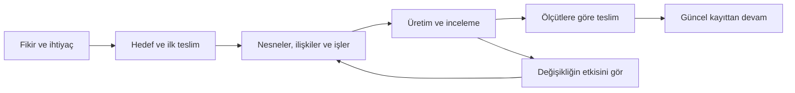
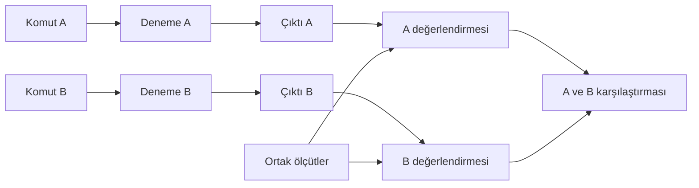

<div align="center">

# Proje Başlat

### Fikrini netleştir. Yapay zekâyla geliştir. Neye göre bittiğini bil.

Projendeki hedefleri, bilgileri, işleri ve kararları birbirine bağlayan Türkçe bir **AI çalışma skill’i**.

**v0.3 pilot · Türkçe · Linux / Python 3.10+ · Yerel proje kayıtları**

[Hemen başla](#hemen-basla) · [Bana ne kazandırır?](#bana-ne-kazandirir) · [Ontoloji nedir?](#ontoloji-nedir) · [Palantir bağlantısı](#palantir-baglantisi) · [Bir proje boyunca](#bir-proje-boyunca)

</div>

---

## Bir fikir var. Peki sıradaki somut iş ne?

Yapay zekâya bir fikrini anlattın. Bir plan çıktı, birkaç dosya oluştu, bazı kararlar alındı. Sonra bir şey değişti:

- Yeni oturumda nerede kaldığını yeniden anlatman gerekti.
- Bir önerinin gerçekten kararlaştırılıp kararlaştırılmadığı belirsizleşti.
- Kaynak değişti ama ona dayanarak yazılan sonuç aynı kaldı.
- Yapılacaklar listesinde iş bitti görünüyordu; hangi koşula göre bittiği belli değildi.

**Proje Başlat, bu bilgileri projenin içinde tutulan ve kontrol edilebilen bir çalışma düzenine çevirir.** Neyi yapmak istediğini, neye dayandığını, hangi işin hazır olduğunu ve neyin yeniden incelenmesi gerektiğini birlikte gösterir.

Bir *skill*, AI ajanına belirli bir işi nasıl yürüteceğini anlatan yönerge ve yardımcı araç paketidir. Buradaki ajan; proje dosyalarını okuyabilen, düzenleyebilen ve komut çalıştırabilen yapay zekâ yardımcındır. Sen amacını normal Türkçeyle anlatırsın; ajan bu paketi kullanarak çalışma kaydını hazırlar ve güncel tutar.

> **Örnek istek:** “Mahallemizdeki etkinlikleri duyuracağım haftalık bir bülten hazırlamak istiyorum. İlk sayı üç etkinlik içersin. Kaynakları belli olsun, henüz kimseye göndermeyelim. Nereden başlayacağımı birlikte netleştirelim.”

Bu istekten hedef kitle, ilk teslim, sınırlar, kaynaklar, işler ve kabul ölçütleri çıkarılabilir. “Bülten hazırla” fikri, ilk yapılabilir adıma dönüşür: üç etkinliğin güncel bilgilerini toplamak.

<a id="bana-ne-kazandirir"></a>

## Yapay zekâyı yeni öğreniyorum. Bana ne kazandırır?

Başlamak için ontoloji, JSON veya yazılım mimarisi öğrenmen gerekmiyor. Önce **kimin hangi işini kolaylaştırmak istediğini** söylemen yeterli; belirsiz kalan noktaları ajanla açarsın. İlk kurulumda dosya ve komut erişimi olan bir ajan ile çalışan Python ortamı gerekir.

| Yaşadığın durum | Skill’in sağladığı çalışma desteği |
|---|---|
| “Fikrim var ama nereden başlayacağımı bilmiyorum.” | İlk somut çıktıyı, kapsamı ve yapılabilir işi netleştirmeye yön verir. |
| “AI çok seçenek sundu, neye karar verdiğimizi karıştırdım.” | Öneriyi, kabul edilmiş kararı ve açık soruyu ayrı kaydeder. |
| “Her şeyi aynı anda yapmaya çalışıyorum.” | Bir işin başlaması için hangi girdilerin ve önceki işlerin hazır olması gerektiğini gösterir. |
| “Bir değişiklik istedim; başka neleri etkileyecek?” | İlan edilmiş bağları izleyerek hangi iş ve incelemelerin etkileneceğini gösterir. |
| “Dün ne yaptığımızı unuttum.” | Proje kaydını okuyarak mevcut durumu, engelleri ve sıradaki işi çıkarır. |
| “AI bitti dedi ama ben nasıl anlayacağım?” | Her işi gözlenebilir kabul ölçütleri ve incelenen dosyalarla ilişkilendirir. |
| “Bir süre ara verdim.” | Sohbet geçmişine ek olarak proje dosyalarından devam edilecek bağlam sağlar. |

Buradaki amaç, **projenin hangi durumda olduğunu anlayarak ilerlemek**. Daha hızlı veya daha başarılı olmayı her projede garanti etmez; bunlar kullanımda ölçülmesi gereken faydalardır.

<a id="bir-proje-boyunca"></a>

## Projeyi kurarken, geliştirirken ve sonuçlandırırken



### 1. Kurarken: belirsizliği yapılabilir işe çevir

Ajan; hedefi, kullanıcıyı, ilk çıktıyı ve “başarılı oldu” diyeceğin koşulları belirginleştirir. Tarih, bütçe veya teknoloji tercihin bilinmiyorsa bunları karar verilmiş gibi yazmaz.

Bülten örneğinde ilk teslim şöyle tarif edilebilir:

> “Üç etkinlik için tarih, yer, katılım bilgisi ve kaynak bağlantısı bulunan bir taslak. Kontrol edilmeden gönderilmeyecek.”

Böylece “profesyonel bir bülten yap” gibi yoruma açık bir talep, incelenebilir bir teslim tanımı kazanır. İlk iş paketi bu hedefe göre hazırlanır.

### 2. Geliştirirken: işleri ve dayanaklarını birlikte izle

Her görevin kullandığı bilgiler ve ürettiği çıktı açıkça bağlanır. Bir işi başlatmak için gereken önceki iş güncel olarak tamamlanmamışsa kontrol aracı bunu bildirir.

Örneğin kaynak doğrulaması bitmeden ona bağlı son kontrol işi hazır sayılmaz. Yazılım projesinde veri biçimi değiştiğinde o veriyi kullanan işler; araştırmada ölçüt değiştiğinde ilgili değerlendirmeler yeniden incelenebilir. Bunun çalışması için ilgili bağların modele tanımlanmış olması gerekir.

Yeni bir ihtiyaç geldiğinde ajan önce değişikliğin etkisini gösterir, sonra yetkili olduğu işlemi kayda geçirir. Böylece değişen şartlarla çalışırken eski kabuller sessizce taşınmaz.

### 3. Sonuçlandırırken: teslimi gözlenebilir koşullarla değerlendir

“Tamamlandı” kaydını anlamlı kılan üç soru vardır:

1. **Ne bekliyorduk?** Görevin kabul ölçütleri.
2. **Neyi inceledik?** Çıktı, kaynak veya test raporunun belirli dosya sürümü.
3. **Bu dayanaklar hâlâ güncel mi?** Dosya, alan verisi ve bağlı iş kontrolleri.

Örneğin bir uygulamada “veri kaydetme tamamlandı” demek yerine, “iki kayıt oluşturuldu, uygulama yeniden açıldı ve ikisi de bulundu” gibi bir senaryo kullanılır. Bu deneyi ajan veya insan gerçekten yapar; kontrol aracı sonucunun hangi dosyalara ve koşullara bağlandığını izler.

**Teknik kontrolün geçmesi ile senin ürünü faydalı bulman ayrı şeylerdir.** Gerçek kullanıcı denemesi gerekiyorsa ayrı görev ve geri bildirim olarak tutulur. Projeyi başlatmak, uygulamanın geliştirilmiş veya yayımlanmış olduğu anlamına gelmez.

<a id="ontoloji-nedir"></a>

## Ontoloji nedir? Bir etkinlik üzerinden düşün

Bu projede ontoloji, **hangi şeylerle çalıştığımızı, bu şeylerin özelliklerini, birbirleriyle bağlarını ve bu bağlara ait kuralları** açıkça tarif etmek demek.

Bir etkinlik bülteni hazırladığını düşün:

| Kavram | Sade anlamı | Örnek |
|---|---|---|
| **Tür** | Aynı özellikleri taşıyan kayıtların tanımı | Etkinlik, kaynak, duyuru |
| **Nesne** | Belirli bir kayıt | Cumartesi yapılacak seramik atölyesi |
| **Özellik** | O kayıt hakkında tuttuğun bilgi | Başlangıç saati: 14.00; yer: kültür merkezi |
| **İlişki** | İki kayıt arasındaki bağ | Duyuru, seramik atölyesini anlatır |
| **Kural** | Kaydın veya ilişkinin uyması gereken koşul | Her duyuru bir etkinliğe bağlı olmalı |
| **Eylem** | Kayıtlı bir değişiklik | Etkinliğin saatini güncellemek |
| **Görev** | Gerçekten yapılacak iş | Duyuruyu yeni saate göre incelemek |

“Etkinlik” türü ile “cumartesi seramik atölyesi” nesnesi aynı şey değildir. Tür, hangi alanların gerektiğini söyler; nesne o alanların somut değerlerini taşır.

### Bağlantı neden önemli?

Duyuru metninde “14.00” yazdığını düşün. Etkinliğin saati 15.00 olduğunda yalnız kaynak kaydı değişmiş olabilir. Metin hâlâ eski saati söylüyorsa bunu görmek gerekir.

Modelde etkinlik bilgisinin duyuruya girdi olduğu tanımlanmışsa, bu değişiklik ilgili incelemenin güncelliğini etkiler. Ajan eski metne yeniden bakması gerektiğini görür. Başka bir etkinlik için yazılmış bağımsız duyurunun aynı nedenle yeniden açılması gerekmez.

Bu bağ **yalnız diyagramdaki bir ok değildir**: görevlerin girdilerini ve kabul durumunu etkiler. İlişkinin adı tek başına yeterli olmaz; hangi yönde değişiklik etkisi taşıdığı da açıkça tanımlanır.

### Yapılacaklar listesine ne ekliyor?

Bir liste “duyuruyu yaz → kontrol et → gönder” sırasını gösterebilir. Alan modeli buna şu soruların yanıtını ekler:

- Bu duyuru hangi etkinlik ve kaynağa dayanıyor?
- Bu kontrol hangi tarih/saat bilgisini incelemişti?
- Kaynak değişince hangi kabul eskidi?
- İşi güncellemek için önce hangi bilginin hazır olması gerekiyor?

Tek oturumluk küçük bir işte basit bir liste yeterli olabilir. Bu ek düzen; işler birbirine bağlandığında, kaynaklar değiştiğinde ve proje farklı oturumlara yayıldığında anlam kazanır.

<a id="palantir-baglantisi"></a>

## Palantir ile bağlantısı ne?

Palantir’in Ontology yaklaşımı, platformdaki verileri gerçek dünyadaki varlıklar ve kavramlarla ilişkilendiren bir çalışma katmanı kurar. Nesneler, özellikler ve ilişkiler birlikte modellenir; bu model üzerinde eylemler uygulanabilir. [Resmî Ontology açıklaması](https://www.palantir.com/docs/foundry/ontology/overview/).

Tür ve örnek ayrımı bu yaklaşımın temel parçalarındandır: tür bir varlık veya olayın şemasını, nesne ise onun belirli bir örneğini temsil eder. İlişki türü iki tür arasındaki bağın tanımıdır. [Palantir tür referansı](https://www.palantir.com/docs/foundry/object-link-types/type-reference/).

Eylemler de modele dâhildir: bir veya birden fazla nesnenin özellikleri ve bağlantıları tanımlı bir işlemle değiştirilebilir. [Palantir eylem türleri](https://www.palantir.com/docs/foundry/action-types/overview/).

**Proje Başlat’ın buradan aldığı tasarım fikri:** Bir projeyi yürütürken hedefi, bilgiyi, ilişkiyi ve yapılacak işi ortak bir model içinde ele almak.

| Esinlenilen fikir | Bu skill’deki yerel uygulama |
|---|---|
| İşin dünyasını nesneler ve ilişkilerle tanımlamak | Her proje için tür sözlüğü ve somut kayıtlar |
| Değişikliği tanımlı eylemlerle yapmak | Doğrulanan nesne, ilişki, görev ve karar işlemleri |
| Modeli günlük iş akışında kullanmak | Girdi/çıktı bağları, önkoşullar ve kabul güncelliği |
| Kayıtlı bilgiyi anlaşılır göstermek | Proje bağlamı, ontoloji görünümü ve ilişki haritası |

Bu tablo bizim tasarım uyarlamamızı anlatır. **Proje Başlat, Palantir ile bağlantılı resmî bir ürün veya Palantir platformunun eşdeğeri değildir.** Palantir hesabı, hizmeti ya da altyapısı kullanmaz. Buradaki uygulama Python ve yerel dosyalarla çalışan küçük bir proje modelidir.

## Somut örnek: iki AI denemesini karşılaştırmak

Diyelim bir videonun açılışını iki farklı komutla deniyorsun. Sonuçları “A daha iyi” diye bir sohbet mesajında bırakmak yerine, karşılaştırmanın dayanaklarını kaydetmek istiyorsun.

**Aşağıdaki örnek kurmacadır; gerçek model performansı iddiası değildir.**

| Kayıt | Deneme A | Deneme B |
|---|---|---|
| Komut | Konuya giriş yapan bir cümle yaz | Kaybolan bir komutu bulamama sorunuyla giriş yap |
| Çıktı | “Bugün AI deneylerimizi düzenliyoruz.” | “Dün işe yarayan komutu bugün bulamıyorsan, deneylerini kaydetmenin zamanı gelmiş.” |
| Ortak ölçüt: somut kayıp komut sorunu | Karşılamıyor | Karşılıyor |
| Ortak ölçüt: tek cümle | Karşılıyor | Karşılıyor |

Bu örneğin alan modeli şu bağları taşıyabilir:



Model ve inceleme kuralları şu ayrımları yapabilir:

- Değerlendirme, hangi çıktıyı hangi ölçütle incelediğini belirtir.
- Karşılaştırmanın iki farklı deneye ve aynı ölçüt kümesine dayanması kontrol edilir.
- Ölçüt değişirse ona bağlı değerlendirme ve karşılaştırmanın kabulü yeniden incelenir.
- Geçmişte üretilen ham çıktı korunur. Yeni koşulla yapılan çalışma ayrı sürüm/kayıt olarak tutulabilir.
- “Bu örnekte B iki ölçütü karşılıyor” sonucu, bütün modeller veya her konu için üstünlük iddiasına dönüştürülmez.

**Pratik kazanç:** Sonucu yeniden açtığında yalnız yorumu değil, o yoruma nasıl ulaşıldığını da görebilirsin.

## Neyi otomatik kontrol eder, neyi sen ve ajan yaparsınız?

| Kontrol kodu | AI ajanı ve insan |
|---|---|
| Zorunlu alan, veri türü ve ilişki uçlarını denetler. | Hangi bilgilerin önemli olduğunu ve alan modelini belirler. |
| İlişki sayısı ve görev bağımlılıklarını kontrol eder. | İçerik üretir, kod geliştirir veya araştırma yapar. |
| Kayıtlı dosya sürümüyle mevcut dosyayı karşılaştırır. | Testi gerçekten çalıştırır; içeriği okuyup değerlendirir. |
| Değişen dayanağın ilgili kabul üzerindeki etkisini hesaplar. | Gereken düzeltmenin ne olduğuna karar verir ve uygular. |
| Tanımlanmış kabul kurallarını değerlendirir. | Ölçütlerin yeterli olup olmadığını ve ürünün işe yarayıp yaramadığını değerlendirir. |

Bir dosyanın değişmediğini bilmek, içeriğinin doğru olduğunu ispatlamaz. “Destekler” adlı bir ilişki de kaynağın iddiayı gerçekten desteklediğini kendi başına kanıtlamaz. Model, açıkça tanımlanan bağımlılıkları izler; kayda girmemiş bir ilişkiyi kendiliğinden keşfetmez.

### İki kaynaktan biri değişirse?

Bazı işler bütün girdileri gerektirir; bazı iddialar ise önceden incelenmiş alternatif kaynaklardan biriyle desteklenebilir. Skill bu iki durumu ayrı modelleyebilir:

- **Hepsi gerekli:** Bir dayanağın kaybı yeniden inceleme gerektirir.
- **En az biri yeterli:** İncelenmiş A değişse de incelenmiş B güncelse kabul korunabilir.

Yeni eklenen bir kaynak kendiliğinden “incelenmiş” sayılmaz. Alternatif kaynakların hangi koşulda yeterli olduğu ajan/insan tarafından açıkça belirtilir. [Destek grupları ve kurallar](skills/proje-baslat/references/ontology.md).

<a id="hemen-basla"></a>

## Hemen başla

### Gerekenler

- Proje dosyalarını okuyup yazabilen ve komut çalıştırabilen bir AI ajanı.
- **Linux ve Python 3.10 veya üzeri.** Diğer işletim sistemleri bu sürümde doğrulanmış değil; CLI Linux dosya kilidi kullanır.
- İndirilen skill dosyaları. Kontrol betikleri ek Python paketi veya API anahtarı istemez. Kullandığın AI hizmetinin erişimi ve maliyeti ayrıdır.

### 1. Paketi indir

Git kullanıyorsan:

```sh
git clone https://github.com/fornhere/proje-baslat-skill.git
cd proje-baslat-skill
python3 --version
```

Git kullanmıyorsan GitHub’daki **Code → Download ZIP** ile indirip klasörü açabilirsin. Açtığın klasörü AI ajanının çalışma alanı yap.

### 2. İlk isteğini ver

Aşağıdaki metni kendi projenle değiştirerek kullan:

```text
skills/proje-baslat/SKILL.md dosyasını oku ve uygula.

Mahalle etkinlikleri için haftalık bir bülten hazırlamak istiyorum.
Hedef kitlem mahallede yaşayan insanlar. İlk çıktı üç kaynaklı etkinlikten
oluşan bir taslak olsun; henüz kimseye göndermeyelim.

Proje klasörü: ../mahalle-bulteni
Önce hedefi ve ilk teslimi netleştir. Bilmediğin tercihleri karar verilmiş
sayma. Alan modelini kur, bana basitçe göster ve ilk yapılabilir işi söyle.
```

Ajan gerektiğinde kısa sorular sorar, proje modelini hazırlar ve kontrol betiğiyle kurar. JSON’u elle yazman beklenmez. Paket klasörünü indirmek her ajan uygulamasında otomatik skill kurulumu anlamına gelmez; **yukarıdaki açık dosya yolu ile çağrı** başlangıç için kullanılabilir.

Skill kullandığın ajan tarafından keşfedilmişse `$proje-baslat` adıyla da çağrılabilir. Keşif ve kalıcı kurulum biçimi kullandığın uygulamaya bağlıdır.

### 3. Gerçek işe devam et

```text
Güncel proje kaydını oku. İlk yapılabilir işi yürüt, sonucunu gerçekten
kontrol et ve inceleme kanıtını kaydet. Yeni karar gerekiyorsa öneriyle
kabul edilmiş kararı ayrı tut.
```

Skill düzeni kurar; içerik yazma, araştırma veya uygulama geliştirme işlerini ajan bu düzen içinde yürütür. Dışarıya gönderme/yayımlama gibi işler ayrıca verdiğin yetkiye bağlıdır.

### 4. Yeni oturumda kaldığın yerden devam et

Ajanı **oluşturduğun projenin klasöründe** aç ve şunu söyle:

```text
Bu projenin .project kaydını oku ve context komutuyla güncel durumu kontrol et.
Hangi işler tamamlanmış, hangi kabuller eskimiş, sıradaki yapılabilir iş ne?
```

Proje kökünde doğrudan çalıştırılabilecek okuma komutları:

```sh
python3 .project/scripts/project.py context .
python3 .project/scripts/project.py ontology .
python3 .project/scripts/project.py check .
```

Mevcut `AGENTS.md` gibi çalışma yönergeleri korunur. Otomatik devam için entegrasyon gerekiyorsa ajan bunu mevcut yönergelerle uzlaştırır; her istemcide kendiliğinden çalışacağı varsayılmaz.

## Projende ne oluşur?

```text
mahalle-bulteni/
├── AGENTS.md                 # Yeni projede kısa devam yönergesi
├── .project/
│   ├── state.json            # Yetkili proje kaydı
│   ├── CONTEXT.md            # Son üretilen durum özeti
│   ├── ONTOLOJİ.md           # Türler, somut kayıtlar ve ilişki haritası
│   ├── integration.md        # Mevcut yönergelerle bütünleştirme metni
│   └── scripts/              # Projeye kopyalanan çalışma betikleri
└── ...                       # Ürettiğin içerik, kod ve diğer çıktılar
```

**Skill paketi ile proje kaydı ayrıdır.** Bu depoyu indiren herkes kendi proje klasöründe kendi kayıtlarını oluşturur. Kontrol kodu bunları otomatik olarak bu GitHub deposuna göndermez.

`CONTEXT.md` ve `ONTOLOJİ.md` son üretilen görünümlerdir. Dosyalar sonradan değişmişse güncel durumu öğrenmek için komutlar yeniden çalıştırılır; arka planda sürekli izleyen bir servis yoktur.

## Hangi işlere uyarlanabilir?

Aşağıdakiler kullanım fikirleridir; her biri için hazır ve doğrulanmış ürün şablonu bulunduğu anlamına gelmez.

| Proje | Örnek nesneler | İzlenebilecek değişiklik |
|---|---|---|
| Küçük yazılım | Gereksinim, veri biçimi, modül, test | Veri biçimi değişince bağlı işlerin yeniden kontrolü |
| Bülten veya araştırma | Kaynak, dar iddia, taslak, inceleme | Kaynak değişince dayanağın güncelliği |
| Video hazırlığı | Kaynak, senaryo bölümü, görsel, teslim | Bilgi değişince ilgili bölümün incelemesi |
| Eğitim içeriği | Öğrenme hedefi, ders, alıştırma, değerlendirme | Hedef değişince ilgili içeriklerin kontrolü |
| AI deney defteri | Komut sürümü, deney, çıktı, ölçüt | Ölçüt değişince değerlendirme ve karşılaştırma |

Birbirine bağlı işleri olan, birkaç oturuma yayılan projelerle denenebilir. Tek seferlik kısa bir metin için bu kadar kayıt tutmak gereksiz olabilir.

## Sık sorulanlar

<details>
<summary><strong>Bu, AI’ın beni ve bütün sohbetlerimi hatırlamasını sağlar mı?</strong></summary>

Proje bağlamını dosyalarda tutar. Kişisel hafıza veya bütün sohbetlerin arşivi değildir. Yeni oturumun devam edebilmesi için ajanın proje dosyalarına erişmesi ve güncel kaydı okuması gerekir.

</details>

<details>
<summary><strong>AI projeyi kendi başına bitirir mi?</strong></summary>

Skill, işi adımlara ayırma, dayanakları izleme ve sonucu denetleme düzeni sağlar. Ajanın yetenekleri, verilen yetkiler, araç erişimi ve hedefin netliği sonucu etkiler. Gerçek kullanıcı tercihi veya değerlendirmesi gereken yerde bu bilgiye hâlâ ihtiyaç vardır.

</details>

<details>
<summary><strong>Projeye sonradan yeni iş eklenebilir mi?</strong></summary>

Evet. Yeni nesne, ilişki ve görevler eklenebilir; görev tanımı ve alan kayıtları desteklenen işlemlerle değiştirilebilir. Ajan önce değişikliğin etkisini inceler. Genel proje hedefini değiştirme veya görev iptali gibi her işlem için hazır bir eylem bulunmaz; desteklenen kapsam [değişiklik rehberinde](skills/proje-baslat/references/plan-changes.md) açıklanır.

</details>

<details>
<summary><strong>“Kontrol geçti” demek bütün proje bitti demek mi?</strong></summary>

Hayır. `check`, kayıt yapısını ve mevcut kanıtların durumunu kontrol eder. Henüz yapılmamış görevler bulunabilir. Tamamlanmayı proje hedefi, açık işler, kabul ölçütleri ve gerekiyorsa gerçek kullanıcı denemesiyle birlikte değerlendirirsin.

</details>

<details>
<summary><strong>Verilerim nerede duruyor?</strong></summary>

Kontrol betikleri kayıtları yerel proje klasöründe tutar; kendi içinde ağ aktarımı yapmaz. AI ajanının bu dosyaları okuması ise kullandığın AI hizmetinin veri işleme koşullarına tabidir. Dosyaları başka bir hizmetle paylaşırsan o paylaşım ayrıca gerçekleşir.

</details>

<details>
<summary><strong>Pakette az dosya olması çalışma düzenini eksiltir mi?</strong></summary>

Çalışma paketi; skill yönergesini, ajan arayüz bilgisini, üç teknik referansı ve dört Python betiğini içerir. Bunlar kurulum ve devam akışının ihtiyaç duyduğu dosyalardır. Kullanıcı projeleri ve geliştirme sırasında üretilen ham araştırma/deneme arşivleri paketin çalışma bağımlılığı değildir.

Yayımlanan v0.3 paketinde yeni proje kurulumu, görev başlatma/kanıt sunma/tamamlama, salt okunur değişiklik provası ve ölçüt değişince ilgili değerlendirmeyi yeniden incelemeye alma akışı kontrol edildi. Bu, her ajan ve işletim sisteminde sorunsuzluk garantisi değildir.

</details>

## Teknik ayrıntılar

<details>
<summary><strong>Komutlar, güncellik denetimi ve yükseltme</strong></summary>

### Komutlar

| Komut | İşlev |
|---|---|
| `init` | Hazırlanmış modelden proje kaydını ve betikleri kurar. |
| `context` | Yapılabilir işleri, engelleri ve güncellik sorunlarını hesaplar. |
| `ontology` | Türleri, nesneleri, ilişkileri ve görev bağlarını gösterir. |
| `check` | Yapısal geçerliliği ve kayıtlı kanıtların güncelliğini denetler. |
| `preview` | Bir değişikliği yazmadan doğrular; etkisini ve kontrol özetini gösterir. |
| `apply` | Beklenen revizyonla doğrulanan işlemi kaydeder. |
| `upgrade` | Kaynak skill paketinden projeye kopyalı betikleri yedekleyerek yeniler. |

### Model ve kabul

- **Türler:** Zorunlu alanlar, değer tipleri ve izinli değerler tanımlanır.
- **İlişkiler:** Uç türleri, iki uçtan bağlantı sayısı ve değişiklik etkisi belirtilir.
- **Görev bağları:** Konu, kullanılan girdi ve üretilen çıktı ayrı tutulur. Girdi üreticilerinden önkoşullar hesaplanır.
- **Başlangıç ve teslim:** Başlangıç girdileri kaydedilir. Çalışma sırasında değişen girdiye eski sonuç teslim edilemez; yeniden başlatma gerekir.
- **Güncellik:** Dosyaların SHA-256 özetleri, ilgili veri/bağ kayıtları ve üretici tamamlanmaları karşılaştırılır. Seçilmiş alanlarla etki sınırlandırılabilir.
- **Kabul kuralları:** Kayıt sayısı, küme eşitliği/ayrıklığı ve all/any koşulları tanımlanabilir. Keyfi kod veya genel mantıksal ispat çalıştırılmaz.
- **Geçmiş:** Korunacak tarihsel türlerde `immutable` kullanılabilir; yeni koşul yeni kimlikle kaydedilir. Dosya hash’i eski dosyanın yedeği değildir.

### Değişiklik ve dosya yazımı

Önizleme ile uygulama aynı geçiş motorunu kullanır. Beklenen revizyon eski bağlamı reddeder; `--preview-digest` önizlemeden sonra başvurulan dosya veya işlem değişimini de kontrol eder. Linux CLI yazıcıları kilitle sıralanır. Haricî editörler bu kilide uymaz; yerel geçmiş imzalı bir denetim defteri değildir.

Yeni projeler şema 3 kullanır. Eski şema 1/2 projelerde runtime yükseltmesi ile ontolojiye geçiş ayrı adımlardır. `upgrade` tek başına eski alan modelini dönüştürmez. [Yükseltme ve geçiş akışı](skills/proje-baslat/references/plan-changes.md).

</details>

## Daha derine in

| Aradığın bilgi | Belge |
|---|---|
| Ajan bu düzeni nasıl uygular? | [Skill yönergeleri](skills/proje-baslat/SKILL.md) |
| Projemin ontolojisini nasıl modellemeliyim? | [Ontoloji rehberi](skills/proje-baslat/references/ontology.md) |
| Alanlar, kurallar ve kanıtlar nasıl tanımlanır? | [Model sözleşmesi](skills/proje-baslat/references/model.md) |
| Değişiklik, yeni iş veya eski projeden geçiş nasıl yapılır? | [Değişiklik rehberi](skills/proje-baslat/references/plan-changes.md) |

**Proje Başlat’ın hedefi:** Bir fikrin hangi işlere dönüştüğünü, bu işlerin neye dayandığını ve sonucun hangi koşullarda kabul edildiğini görünür tutmak.
