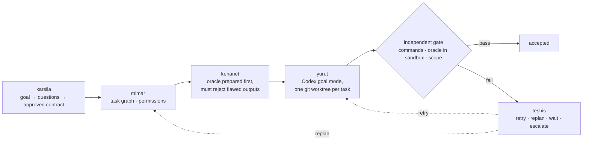

[English](README.md) · [Türkçe](README.tr.md)

# Orvant

**Your coding agent says "done". Orvant asks for proof.**

*Ajan "bitti" der; Orvant kanıt ister.*

[](LICENSE)


Orvant connects project goals, domain objects, sources, decisions and tasks. For software projects, its Python engine coordinates Codex work and checks the result through an independent acceptance gate.

> **Open beta — 0.1.0b1.** Start with small Python CLIs, data automation or narrow repository maintenance. Broad autonomous project completion and reduced user effort have not been established.

## Why it's different

- **"Complete" is a claim, not a verdict.** A worker saying `complete` never establishes acceptance. Each result must pass an independent gate: the declared acceptance commands, the oracle (`kehanet`) run inside `codex sandbox`, and a check that the work stayed inside its writable scope.
- **The test comes before the work.** The architect prepares independent oracle checks bound to the contract's requirements before anything executes. Applicable deliberately flawed outputs must be rejected before the oracle is accepted.
- **You approve a contract, not a vibe.** Intake turns your goal into a decision map and real questions. Planning starts only after you approve the displayed contract revision.
- **A failure gets a diagnosis, not a blind retry.** Failures are classified, with a proposed next step: retry, replan, wait for input or permission, or escalate to you.
- **Each task stays in its lane.** Every task runs in its own git worktree, and real decision questions are collected in a queue for you instead of being guessed.

## How it works


```mermaid
flowchart LR
    K["karsila<br/>goal → questions → approved contract"] --> M["mimar<br/>task graph · permissions"]
    M --> O["kehanet<br/>oracle prepared first,<br/>must reject flawed outputs"]
    O --> Y["yurut<br/>Codex goal mode,<br/>one git worktree per task"]
    Y --> G{"independent gate<br/>commands · oracle in sandbox · scope"}
    G -- pass --> A["accepted"]
    G -- fail --> T["teşhis<br/>retry · replan · wait · escalate"]
    T -. retry .-> Y
    T -. replan .-> M
```

Commands, identifiers and CLI messages are in Turkish: `orvant karsila` (intake), `orvant mimar` (architect), `orvant yurut` (execution). `orvant surdur` continues an existing plan within round, time and observed quota limits; it does not create the initial intake or plan.

**[Quick start →](#install-the-engine)** · [Engine](docs/MOTOR.md) · [Usage](docs/KULLANIM.md) · [FAQ](docs/SSS.md) · [Beta scope](docs/BETA.md) · [Technical design](TEKNIK-TASARIM.md)

## Two components

- **Skill:** `skills/orvant/SKILL.md` guides an agent in creating and maintaining a local `.project` record. Its ontology distinguishes types from instances, defines relationships and tracks how changes affect dependent work.
- **Engine:** `orvant` turns a goal into an approved contract, builds a task graph, executes authorized work, diagnoses failures and continues an existing session. A worker saying `complete` does not establish acceptance.

The skill's project record and the engine's session are separate. An accepted decision in `.project` does not replace approval of the engine's contract revision.

## Install the engine

From this checkout on Linux, with Python **3.11+** and Git:

```sh
python3 -m venv .venv
. .venv/bin/activate
python3 -m pip install .
orvant --help
orvant karsila --help
orvant surdur --help
```

The runtime uses Python's standard library. Real model calls and execution require authenticated **Codex CLI** with goal support and `codex sandbox`. The engine was developed against `codex-cli 0.155.1`; compatibility with other versions and engine behavior on macOS or Windows remain unverified.

The wheel installs the engine. To use the skill, explicitly give your file-capable agent [SKILL.md](skills/orvant/SKILL.md); copying the skill alone does not install the engine. The separate project-record runtime supports Python **3.10+** on Linux, macOS and Windows.

## Start and continue

Give the agent your goal and the target repository, then ask it to follow the [engine workflow](skills/orvant/references/engine.md). Keep the engine session outside both the target repository and this checkout.

The workflow is intake → actual user answers → approval of the displayed contract revision → initial plan → authorized execution. Once a plan exists, resume that session with `orvant surdur`; it does not create the initial intake or plan. Read the stop reason, pending questions and acceptance receipts before treating a run as complete.

For a local project record, the agent prepares an ontology and records the real sources, tasks and decisions. Existing records are read with `context` and `ontology`; changes are previewed before application. See the [usage guide](docs/KULLANIM.md).

## Scope and limits

The beta includes intake, planning, execution, diagnosis and operator continuation. The independent oracle (`kehanet`) binds checks to acceptance requirements and challenges applicable flawed outputs before work is accepted. These checks depend on the quality of the contract and the oracle; they do not establish general semantic correctness.

Acceptance commands run locally. Review the plan and granted permissions before real execution. The project-record scripts do not send network requests themselves; an AI agent reading project files is subject to its provider's data handling rules.

[Engine guide](docs/MOTOR.md) · [Usage](docs/KULLANIM.md) · [FAQ](docs/SSS.md) · [Technical design](TEKNIK-TASARIM.md)

## License

[MIT](LICENSE).
