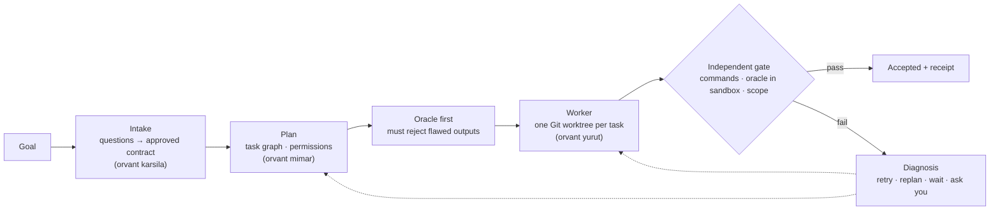

[English](README.md) · [Türkçe](README.tr.md)

# Orvant

**Your coding agent says "done". Orvant asks for proof.**

A skill and a Python CLI that turn a goal into an approved contract, write the acceptance check before the work, and accept agent output only through an independent gate.

[](https://github.com/fornhere/orvant/actions/workflows/package.yml) [](https://github.com/fornhere/orvant/actions/workflows/skill-tests.yml) [](LICENSE)  

## Proof first

The no-model demo produces a project record with one workable task and one blocked by its prerequisite:

```text
- T-INCELE [todo] Örnek metnin tek cümle oluşunu incele (kayıt: todo)
- T-KONTROL [blocked] İnceleme gerekçesini kontrol et (kayıt: todo)
  - Etkin önkoşullar: T-INCELE

## Çalışılabilir görevler

T-INCELE
```

This is copied verbatim from [`context.txt`](docs/sample-output/context.txt), generated by the documented [sample commands](docs/sample-output/KOMUTLAR.md). See the real [initialization output](docs/sample-output/init.txt) and [ontology map](docs/sample-output/ontology.md), too.

## Why not just run the agent?

| | Agent alone | With Orvant |
|---|---|---|
| What makes “done” true? | The agent's claim | Declared commands, an oracle, and a scope gate |
| Who writes the check? | Often the worker | An independent oracle is prepared first |
| What follows failure? | Another attempt | Diagnosis: retry, replan, wait, or ask you |
| Who resolves ambiguity? | The agent may guess | Decisions are queued for you |
| How is work isolated? | Depends on the setup | One Git worktree per task |

## How it works


```mermaid
flowchart LR
  G["Goal"] --> I["Intake<br/>questions → approved contract<br/>(orvant karsila)"]
  I --> P["Plan<br/>task graph · permissions<br/>(orvant mimar)"]
  P --> O["Oracle first<br/>must reject flawed outputs"]
  O --> W["Worker<br/>one Git worktree per task<br/>(orvant yurut)"]
  W --> GA{"Independent gate<br/>commands · oracle in sandbox · scope"}
  GA -- pass --> A["Accepted + receipt"]
  GA -- fail --> D["Diagnosis<br/>retry · replan · wait · ask you"]
  D -.-> W
  D -.-> P
```

## Try it in 60 seconds

No coding agent CLI or API key is needed. `init` creates an `AGENTS.md` in the target directory.

```sh
git clone https://github.com/fornhere/orvant && cd orvant
python3 skills/orvant/scripts/project.py init /tmp/orvant-demo --spec examples/demo-spec.json
python3 /tmp/orvant-demo/.project/scripts/project.py context /tmp/orvant-demo
python3 /tmp/orvant-demo/.project/scripts/project.py ontology /tmp/orvant-demo
```

You will see the ready task, its blocked dependent task, and a Mermaid object map shown in the [recorded outputs](docs/sample-output/).

## Run it on your repository

The engine requires Linux, Git, Python 3.11+, and installed, signed-in **Codex CLI or Claude Code (one is enough)**. Both are supported equally; neither is the default or experimental. It was developed with `codex-cli 0.155.1`; other versions are unverified, and no verified Claude Code version is claimed. Engine behavior on macOS or Windows is unverified.

Worker selection: `ORVANT_YURUTUCU=codex|claude` takes precedence over `orvant.toml` with `[yurutucu] tur = "codex"` or `tur = "claude"`. Without either setting, exactly one installed executable (on PATH or at its configured path) is detected automatically. If both are installed, explicit selection is required; otherwise Orvant reports `iki yürütücü bulundu` (two executors found).

Oracle OS isolation on Linux requires bubblewrap (`bwrap`) or Codex sandbox (`codex sandbox`), independently of the selected worker. In `orvant.toml`, `[kehanet] yalitim = "auto"` tries verified `bwrap` first, then Codex sandbox; `yalitim = "bwrap"` or `yalitim = "codex"` forces that backend. If no usable isolation backend is available, Orvant does not run the oracle: it fails closed and never runs it without isolation.

```sh
python3 -m venv .venv && . .venv/bin/activate && python3 -m pip install .
orvant karsila baslat "<session>" --hedef "<goal>"       # no model
orvant karsila ilerle "<session>"                        # may call model
orvant karsila sorular "<session>"                       # no model; answer as the real user
orvant karsila cevapla "<session>" "<question-id>" "<answer>" # no model
orvant karsila onayla "<session>" "<revision>"           # no model; user approval
orvant mimar plan "<session>" --depo "<repository>"      # calls model
orvant surdur "<session>" --kuru                          # no model
orvant surdur "<session>"                                # may call model and run work
```

Keep the session outside the target repository and this checkout. Review the stop reason, open questions, permissions, and acceptance receipts; exit code 0 alone does not mean completion. The `orvant proje` command is experimental.

## Use it with your agent

Give a file-capable agent [`skills/orvant/SKILL.md`](skills/orvant/SKILL.md) and say: “Follow this skill to create a local project record for this goal.” The wheel installs the engine, not the skill; the project-record runtime separately supports Python 3.10+ on Linux, macOS, and Windows.

## Beta scope and limits

> **Open beta — 0.1.0b1.** Start with small Python CLIs, data automation, or narrow repository maintenance. Broad autonomous project completion and reduced user effort have not been established.

The beta covers intake, planning, execution, diagnosis, and continuation. Acceptance depends on the contract and oracle quality; it does not establish general semantic correctness. User answers, contract approval, and permission decisions belong to the real user. Review plans and permissions before execution. Project-record scripts make no network requests themselves, but an agent reading files remains subject to its provider's data-handling rules.

## Documentation

| Guide | Language |
|---|---|
| [Engine (Turkish)](docs/MOTOR.md) | Turkish |
| [Usage and project records (Turkish)](docs/KULLANIM.md) | Turkish |
| [FAQ (Turkish)](docs/SSS.md) | Turkish |
| [Beta scope (Turkish)](docs/BETA.md) | Turkish |
| [Technical design (Turkish)](TEKNIK-TASARIM.md) | Turkish |
| [Engine workflow (Turkish)](skills/orvant/references/engine.md) | Turkish |
| [Project model (Turkish)](skills/orvant/references/model.md) | Turkish |
| [Ontology (Turkish)](skills/orvant/references/ontology.md) | Turkish |
| [Plan changes (Turkish)](skills/orvant/references/plan-changes.md) | Turkish |

## License and issues

[MIT](LICENSE). Found a problem? [Open an issue](https://github.com/fornhere/orvant/issues) without sharing private project content or credentials.
