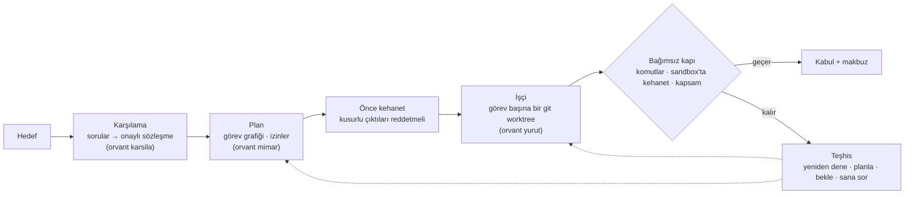

[English](README.md) · [Türkçe](README.tr.md)

# Orvant

**Kodlama ajanınız "bitti" der; Orvant kanıt ister.**

Hedefi onaylı bir sözleşmeye dönüştüren, kabul denetimini işten önce yazan ve ajan çıktısını yalnızca bağımsız bir kapıdan geçerse kabul eden bir skill ve Python CLI'ı.

[](https://github.com/fornhere/orvant/actions/workflows/package.yml)
[](https://github.com/fornhere/orvant/actions/workflows/skill-tests.yml)
[](LICENSE)


## Önce kanıt

Bu kesit, demo spec'iyle çalışan [`context`](docs/sample-output/context.txt) komutunun gerçek çıktısıdır:

```text
- T-KONTROL [blocked] İnceleme gerekçesini kontrol et (kayıt: todo)
  - Ölçüt: Gerekçenin kayıtlı metinle uyumu gerçekten incelenmiş.
  - İlgili nesneler: inceleme-a
  - Girdiler: inceleme-a
  - Ürettiği nesneler: yok
  - Etkin önkoşullar: T-INCELE
  - Üretici bağı: inceleme-a ← T-INCELE
  - Kabul güncelliği: henüz doğrulanmadı · tamamlanma sayısı: 0
  - Kontrol: dependency T-INCELE: todo

## Çalışılabilir görevler

T-INCELE
```

Üretim komutları ve değiştirilmemiş çıktıların tümü [`docs/sample-output/`](docs/sample-output/KOMUTLAR.md) altında.

## Ajanı doğrudan çalıştırmak neden yetmez?

| | Yalnız ajan | Orvant ile |
| --- | --- | --- |
| “Bitti” neye dayanır? | Ajanın beyanına | Tanımlı komutlara, kehanete ve kapsam kapısına |
| Denetimi kim yazar? | Çoğu kez işçi | Önce bağımsız kehanet hazırlanır |
| Hata olunca | Yeni bir deneme | Teşhis: yeniden dene, planla, bekle veya sana sor |
| Belirsiz karar | Ajan tahmin edebilir | Kararlar kullanıcı için kuyruğa alınır |
| Görev yalıtımı | Kuruluma bağlı | Her görev için ayrı git worktree |

## Nasıl çalışır



## 60 saniyede dene

Kodlama ajanı CLI’ı ve API anahtarı gerekmez. `init`, hedefte bir `AGENTS.md` dosyası oluşturur.

```sh
git clone https://github.com/fornhere/orvant && cd orvant
python3 skills/orvant/scripts/project.py init /tmp/orvant-demo --spec examples/demo-spec.json
python3 /tmp/orvant-demo/.project/scripts/project.py context /tmp/orvant-demo
python3 /tmp/orvant-demo/.project/scripts/project.py ontology /tmp/orvant-demo
```

Çıktıda çalışmaya hazır `T-INCELE` görevini, önkoşul bekleyen `T-KONTROL` görevini ve nesne haritasını göreceksiniz.

## Kendi deponuzda çalıştırın

Motor Linux, Git, Python 3.11+ ve kurulu, oturum açılmış **Codex CLI veya Claude Code (biri yeterli)** gerektirir. İkisi eşit desteklenir; hiçbiri varsayılan veya deneysel değildir. Motor `codex-cli 0.155.1` ile geliştirilmiştir; diğer sürümler doğrulanmadı ve Claude Code için doğrulanmış sürüm iddiası yoktur. macOS veya Windows motor davranışı doğrulanmadı.

İşçi seçimi: `ORVANT_YURUTUCU=codex|claude`, `orvant.toml` içindeki `[yurutucu] tur = "codex"` veya `tur = "claude"` ayarından önceliklidir. İkisi de belirtilmezse PATH'te veya ayarlı yolunda kurulu tek ikili otomatik algılanır. İkisi de kuruluysa açık seçim zorunludur; aksi halde Orvant `iki yürütücü bulundu` hatası verir.

Linux'ta kehanetin OS yalıtımı, seçilen işçiden bağımsız olarak bubblewrap (`bwrap`) veya Codex sandbox (`codex sandbox`) gerektirir. `orvant.toml` içindeki `[kehanet] yalitim = "auto"` önce doğrulanmış `bwrap`, sonra Codex sandbox dener; `yalitim = "bwrap"` veya `yalitim = "codex"` ilgili arka ucu zorlar. Kullanılabilir yalıtım arka ucu yoksa Orvant kehaneti çalıştırmaz: kapı kapanır, yalıtımsız koşmaz.

```sh
python3 -m venv .venv && . .venv/bin/activate && python3 -m pip install .
orvant karsila baslat "<oturum>" --hedef "<hedef>"           # model çağrısı yok
orvant karsila ilerle "<oturum>"                             # model çağırabilir
orvant karsila sorular "<oturum>"                            # model çağrısı yok
orvant karsila cevapla "<oturum>" "<soru-id>" "<cevap>"      # kullanıcı kararı
orvant karsila onayla "<oturum>" "<revizyon>"                # kullanıcı kararı
orvant mimar plan "<oturum>" --depo "<depo>"                # model çağırır
orvant surdur "<oturum>" --kuru                              # işi yürütmez
orvant surdur "<oturum>"                                    # model çağırabilir
```

Oturumu hedef deponun ve bu kaynak ağacının dışında tutun. Sorulara gerçekten kullanıcı cevap vermeli ve yalnızca ekranda gösterilen sözleşme revizyonu onaylanmalıdır. `surdur` ilk karşılamayı ya da planı oluşturmaz. Bitiş nedenini, açık soruları, izinleri ve kabul makbuzlarını inceleyin; yalnızca sıfır çıkış kodu tamamlanma anlamına gelmez. `orvant proje` komutu deneyseldir.

## Ajanınızla kullanın

Dosya okuyup komut çalıştırabilen ajanınıza [`skills/orvant/SKILL.md`](skills/orvant/SKILL.md) dosyasını verin. Örneğin: “Bu depoda hedefimi uygula; Orvant skill'ini izle, kararları tahmin etme ve değişiklikleri uygulamadan önce önizle.” Wheel yalnız motoru kurar; skill ayrıca verilmelidir. Proje kayıt runtime’ı ayrıca Linux, macOS ve Windows üzerinde Python 3.10+ destekler.

## Beta kapsamı ve sınırlar

> **Açık beta — 0.1.0b1.** Küçük Python CLI'ları, veri otomasyonu veya dar kapsamlı depo bakım işleriyle başlayın. Geniş kapsamlı otonom proje tamamlama ve kullanıcı emeğinin azaldığı henüz doğrulanmış değildir.

Beta; karşılama, planlama, yürütme, teşhis ve operatörün mevcut oturumu sürdürmesi akışlarını kapsar. Bağımsız kehanet kontrolleri kabul gereklerine bağlar ve uygulanabilir kusurlu çıktılarla sınar; sözleşmenin ve kehanetin kalitesine bağlıdır, genel anlamsal doğruluğu kanıtlamaz. Kullanıcı cevapları, sözleşme onayı ve izin kararları gerçek kullanıcıya aittir.

Kabul komutları yerelde çalışır; gerçek yürütmeden önce planı ve verilen izinleri inceleyin. Proje kayıt betikleri kendileri ağ isteği göndermez. Dosyaları okuyan bir AI ajanı ise hizmet sağlayıcısının veri işleme koşullarına tabidir.

## Belgeler

| Belge | Dil |
| --- | --- |
| [Motor rehberi](docs/MOTOR.md) | Türkçe |
| [Kullanım ve proje kaydı](docs/KULLANIM.md) | Türkçe |
| [Sık sorulanlar](docs/SSS.md) | Türkçe |
| [Beta kapsamı](docs/BETA.md) | Türkçe |
| [Teknik tasarım](TEKNIK-TASARIM.md) | Türkçe |
| [Motor akışı](skills/orvant/references/engine.md) | Türkçe |
| [Proje modeli](skills/orvant/references/model.md) | Türkçe |
| [Ontoloji](skills/orvant/references/ontology.md) | Türkçe |
| [Plan değişiklikleri](skills/orvant/references/plan-changes.md) | Türkçe |

## Lisans ve sorunlar

[MIT lisansı](LICENSE) · [GitHub Issues](https://github.com/fornhere/orvant/issues). Sorun bildirirken özel proje içeriği veya kimlik bilgisi paylaşmayın.
