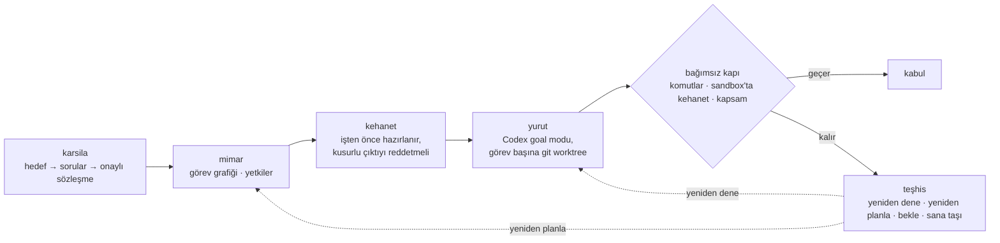

[English](README.md) · [Türkçe](README.tr.md)

# Orvant

**Ajan "bitti" der; Orvant kanıt ister.**

*Your coding agent says "done". Orvant asks for proof.*

[](LICENSE)


Orvant; hedefi, alan nesnelerini, kaynakları, kararları ve işleri birlikte tutar. Yazılım projelerinde Python motoru Codex işlerini yürütür ve sonucu bağımsız bir kabul kapısından geçirir.

> **Açık beta — 0.1.0b1.** İlk kapsam küçük Python CLI'ları, veri otomasyonu ve dar depo bakım işleridir. Genel proje otonomluğu veya kullanıcı emeğini azaltma iddiası henüz doğrulanmış değildir.

## Neden farklı

- **"Bitti" bir iddiadır, karar değil.** İşçinin `complete` demesi kabul değildir. Sonuç bağımsız kapıdan geçmelidir: ilan edilmiş kabul komutları, `codex sandbox` içinde çalışan kehanet ve yazma kapsamı denetimi.
- **Sınav işten önce gelir.** Mimar, yürütmeden önce sözleşmenin gereksinimlerine bağlı bağımsız kehanet kontrollerini hazırlar. Uygulanabilir kasıtlı kusurlu çıktılar reddedilmeden kehanet kabul edilmez.
- **Onayladığın şey bir sözleşmedir.** Karşılama hedefini karar haritasına ve gerçek sorulara çevirir. Plan ancak gösterilen sözleşme revizyonunu onayladıktan sonra başlar.
- **Başarısızlık teşhis edilir, körlemesine tekrarlanmaz.** Neden sınıflanır ve sonraki adım önerilir: yeniden dene, yeniden planla, girdi/izin bekle ya da sana taşı.
- **Her görev kendi şeridinde.** Her görev ayrı bir git worktree'sinde yürür; gerçek karar soruları tahmin edilmez, senin için kuyrukta toplanır.

## Nasıl çalışır



`orvant surdur` mevcut planı tur, süre ve gözlenen kota sınırları içinde sürdürür; ilk karşılamayı veya planı oluşturmaz.

**[Hızlı başlangıç →](#kurulum)** · [Motor](docs/MOTOR.md) · [Kullanım](docs/KULLANIM.md) · [SSS](docs/SSS.md) · [Beta kapsamı](docs/BETA.md) · [Teknik tasarım](TEKNIK-TASARIM.md)

## Skill ve motor

**Skill**, dosyaları okuyup komut çalıştırabilen ajana projeyi nasıl kurup sürdüreceğini anlatır. Yerel `.project` kaydı; hedefi, somut nesneleri, ilişkileri, kararları, görevleri ve kabul dayanaklarını saklar. Ontoloji mantığı korunur: tür ile nesne ayrı tutulur, ilişkinin kuralları açıkça tanımlanır, girdideki değişimin bağlı incelemelere etkisi izlenir.

**Motor**, hedefi onaylı sözleşmeye, sözleşmeyi görev grafiğine çevirir; yetkili işleri yürütür, başarısızlığı teşhis eder ve mevcut oturumdan devam eder. İşçinin “bitti” demesi yeterli değildir; sonuç bağımsız kapının kabulünü almalıdır.

`.project` kaydı ile motor oturumu ayrıdır. Kayıttaki kabul edilmiş karar, motor sözleşmesinin revizyon onayı yerine geçmez.

## Kurulum

Motor için Linux, Python **3.11+** ve Git gerekir. Bu deponun kökünden:

```sh
python3 -m venv .venv
. .venv/bin/activate
python3 -m pip install .
orvant --help
orvant karsila --help
orvant surdur --help
```

Gerçek model çağrısı ve yürütme için kimliği doğrulanmış **Codex CLI**, goal desteği ve `codex sandbox` gerekir. Motor `codex-cli 0.155.1` temel alınarak geliştirilmiştir; başka sürümler ve motorun macOS/Windows davranışı doğrulanmış sayılmaz. Runtime ek Python bağımlılığı istemez.

Wheel motoru kurar. Skill için ajana [skills/orvant/SKILL.md](skills/orvant/SKILL.md) dosyasını açıkça okut. Skill'i tek başına kopyalamak motoru kurmaz. Ayrı kayıt runtime'ı Linux, macOS ve Windows üzerinde Python **3.10+** kullanır.

## Başlama ve devam etme

Ajanına hedefini ve çalışılacak depoyu anlat; [motor akışını](skills/orvant/references/engine.md) izlemesini iste. Motor oturumu hem ürün deposunun hem bu kaynak ağacının dışında olsun.

Akış: hedef → gerçek sorular ve cevaplar → gösterilen sözleşme revizyonunun onayı → ilk plan → yetkili yürütme. Plan zaten varsa aynı oturumda `orvant surdur` kullanılır; bu komut ilk karşılama veya planı oluşturmaz. Çıkış kodu yerine bitiş nedenini, açık soruları ve kabul makbuzlarını birlikte değerlendir.

Kayıt/ontoloji tarafında ajan modeli projenin gerçek kavramlarıyla kurar. Yeni oturumda `context` ve `ontology` ile güncel durumu okur; değişikliği önce önizler, sonra uygular. [Kullanım rehberi](docs/KULLANIM.md).

## Beta sınırları

Bu sürüm karşılama, mimari planlama, yürütme, teşhis ve operatör devam akışını içerir. Kehanet, kabul koşullarını görevden bağımsız denetler; ölçütlerin yeterliliği ve modelin yorumları yine incelenmelidir. Yerel kabul komutları çalıştırılır; gerçek yürütmeden önce planı ve izinleri gözden geçir.

Kayıt betikleri kendi içinde ağ aktarımı yapmaz. Ajan proje dosyalarını okuduğunda kullanılan AI hizmetinin veri işleme koşulları geçerlidir.

[Motor](docs/MOTOR.md) · [Kullanım](docs/KULLANIM.md) · [Sık sorulanlar](docs/SSS.md) · [Teknik tasarım](TEKNIK-TASARIM.md) · [MIT lisansı](LICENSE)
