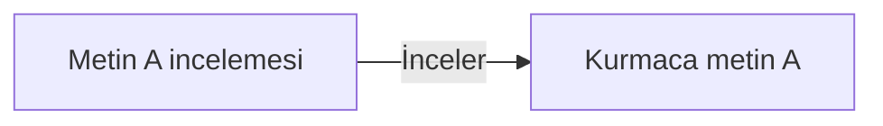

# Sentetik çıktı incelemesi — Ontoloji

Revizyon: 0. Canlı görünüm için `ontology` komutunu çalıştır.

## Türler ve özellikler

### İncelenen metin (`input`)

- text: string; zorunlu; seçenekler: None
### İnceleme (`assessment`)

- verdict: string; zorunlu; seçenekler: ['pending', 'pass', 'fail']

## İlişki kuralları

- İnceler (`examines`): assessment → input; kaynak başına 1..1, hedef başına 0..çok; etki: reverse

## Somut nesneler

- **Kurmaca metin A** (`metin-a`, input): {"text": "Bugün aynı komutu iki kez denedim."}; durum: input; üretici: dış girdi
- **Metin A incelemesi** (`inceleme-a`, assessment): {"verdict": "pending"}; durum: pending; üretici: T-INCELE

## Nesne haritası

Oklar kayıtlı ilişki yönüdür; değişiklik etkisinin yönü üstte ayrıca tanımlıdır.

## Görevlerin veri bağları

- **T-INCELE — Örnek metnin tek cümle oluşunu incele**: girdiler [metin-a], çıktılar [inceleme-a], durum todo.
- **T-KONTROL — İnceleme gerekçesini kontrol et**: girdiler [inceleme-a], çıktılar [], durum blocked.

Etki yeniden inceleme ihtiyacıdır; nesnenin yanlış olduğu hükmü değildir.
